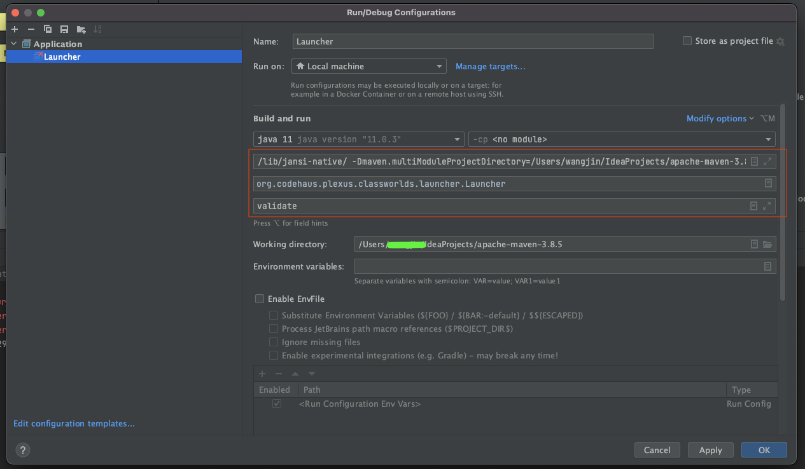

# 基础构建

按照 [README.md](./README.md) 中的说明：

> Quick Build
>
> If you want to bootstrap Maven, you'll need:
>
> + Java 1.7+
> + Maven 3.0.5 or later
> + Run Maven, specifying a location into which the completed Maven distro should be installed:
> 
>> mvn -DdistributionTargetDir="$HOME/app/maven/apache-maven-3.6.x-SNAPSHOT" clean package

我在本地构建时使用了如下命令：
```bash
mvn -DdistributionTargetDir="~/IdeaProjects/apache-maven-3.8.5-SNAPSHOT" clean package
```
注意 distributionTargetDir 指定的文件夹需要已存在，否则报错。

构建成功后，会在各个子模块的 target 目录下生成模块对应的jar包。

# 源码调试
## 寻找启动类
如何找到启动类？
TODO 通过命令执行文件

启动类路径：
```java
org.codehaus.plexus.classworlds.launcher.Launcher#main
```
启动类内容如下：
```java
    public static void main( String[] args )
    {
        try
        {
            int exitCode = mainWithExitCode( args );

            System.exit( exitCode );
        }
        catch ( Exception e )
        {
            e.printStackTrace();

            System.exit( 100 );
        }
    }
```
## 配置启动参数
如何找到启动参数？
TODO源码or命令行文件
```bash
exec "$JAVACMD" \
  $MAVEN_OPTS \
  $MAVEN_DEBUG_OPTS \
  -classpath "${CLASSWORLDS_JAR}" \
  "-Dclassworlds.conf=${MAVEN_HOME}/bin/m2.conf" \
  "-Dmaven.home=${MAVEN_HOME}" \
  "-Dlibrary.jansi.path=${MAVEN_HOME}/lib/jansi-native" \
  "-Dmaven.multiModuleProjectDirectory=${MAVEN_PROJECTBASEDIR}" \
  ${CLASSWORLDS_LAUNCHER} "$@"

```
IDEA中使用maven `validate` 命令的参数，供参考：
```bash
/Library/Java/JavaVirtualMachines/jdk1.8.0_212.jdk/Contents/Home/bin/java \
-Dmaven.multiModuleProjectDirectory=/Users/abc/IdeaProjects/apache-maven-3.8.5 \
-Dmaven.home=/Users/abc/Library/Application Support/JetBrains/Toolbox/apps/IDEA-U/ch-0/211.6693.111/IntelliJ IDEA.app/Contents/plugins/maven/lib/maven3 \
-Dclassworlds.conf=/Users/abc/Library/Application Support/JetBrains/Toolbox/apps/IDEA-U/ch-0/211.6693.111/IntelliJ IDEA.app/Contents/plugins/maven/lib/maven3/bin/m2.conf \
-Dmaven.ext.class.path=/Users/abc/Library/Application Support/JetBrains/Toolbox/apps/IDEA-U/ch-0/211.6693.111/IntelliJ IDEA.app/Contents/plugins/maven/lib/maven-event-listener.jar \
-javaagent:/Users/abc/Library/Application Support/JetBrains/Toolbox/apps/IDEA-U/ch-0/211.6693.111/IntelliJ IDEA.app/Contents/lib/idea_rt.jar=49875:/Users/abc/Library/Application Support/JetBrains/Toolbox/apps/IDEA-U/ch-0/211.6693.111/IntelliJ IDEA.app/Contents/bin \
-Dfile.encoding=UTF-8 \
-classpath /Users/abc/Library/Application Support/JetBrains/Toolbox/apps/IDEA-U/ch-0/211.6693.111/IntelliJ IDEA.app/Contents/plugins/maven/lib/maven3/boot/plexus-classworlds.license:/Users/abc/Library/Application Support/JetBrains/Toolbox/apps/IDEA-U/ch-0/211.6693.111/IntelliJ IDEA.app/Contents/plugins/maven/lib/maven3/boot/plexus-classworlds-2.6.0.jar \
org.codehaus.classworlds.Launcher \
-Didea.version=2021.1 validate
```
### jvm 启动参数
+ classpath
  + classpath 不需要，在IDEA环境中会自动加载好此参数。这也是我们能够调试maven源码的关键。  


+ -Dclassworlds.conf
```bash
-Dclassworlds.conf=/Users/abc/Library/Application Support/JetBrains/Toolbox/apps/IDEA-U/ch-0/211.6693.111/IntelliJ IDEA.app/Contents/plugins/maven/lib/maven3/bin/m2.conf
```
```bash
-Dclassworlds.conf=/Users/abc/CodeSoftware/maven/apache-maven-3.8.5/bin/m2.conf
```

+ -Dmaven.home
  + maven的安装路径
```bash
-Dmaven.home=/Users/abc/CodeSoftware/maven/apache-maven-3.8.5/
```

+ -Dlibrary.jansi.path
  + 用于在Windows下处理ansi的库的位置，非Windows可以不用配置。
    
```bash
-Dlibrary.jansi.path=/Users/abc/CodeSoftware/maven/apache-maven-3.8.5/lib/jansi-native/
```

+ -Dmaven.multiModuleProjectDirectory
  + maven要操作的“目标项目”的路径。比如我们有个spring-boot的项目，使用`mvn clean`对清理这个项目。那么此时multiModuleProjectDirectory
    就是指当前这个spring-boot项目的根路径，而不是maven安装的根目录。
```bash
-Dmaven.multiModuleProjectDirectory=/Users/abc/IdeaProjects/apache-maven-3.8.5
```

最后，我们汇总一下在IDEA中启动`org.codehaus.plexus.classworlds.launcher.Launcher.main`需要的参数：
```bash
-Dclassworlds.conf=/Users/abc/CodeSoftware/maven/apache-maven-3.8.5/bin/m2.conf -Dmaven.home=/Users/abc/CodeSoftware/maven/apache-maven-3.8.5/ -Dlibrary.jansi.path=/Users/abc/CodeSoftware/maven/apache-maven-3.8.5/lib/jansi-native/ -Dmaven.multiModuleProjectDirectory=/Users/abc/IdeaProjects/apache-maven-3.8.5
```
我们将以上参数添加到IDEA的中“VM Options”中，使其成为jvm参数。供程序运行时读取。

另外我们需要给它添加程序启动参数“Program Arguments”。加入我们需要调试一下`mvn validate`方式对应的源码执行过程。那么我们需要将`validate`
添加到“Program Arguments”中即可，之后我们如果需要测试不同的maven参数，修改这个值即可。

整个配置如下图所示：


# 启动时问题修复
1. [ERROR] Failed to execute goal org.apache.maven.plugins:maven-enforcer-plugin:3.0.0:enforce (enforce-bytecode-version) on project maven: The plugin org.apache.maven.plugins:maven-enforcer-plugin:3.0.0 requires Maven version 3.1.1 -> [Help 1]
+ maven启动时`org.apache.maven.rtinfo.internal.DefaultRuntimeInformation.getMavenVersion`方法会从`META-INF/maven/org.apache.maven/maven-core/pom.properties`文件内读取当前软件版本号。本项目目前配置的默认值时`2.1-SNAPSHOT`。故此时校验会出错。因为当前代码的版本为`3.8.5`，
  因此我们将版本改为`3.8.5`即可。
+ 修改1：
  + 修改文件路径为：`maven-core/src/test/resources/META-INF/maven/org.apache.maven/maven-core/pom.properties`
  + 修改文件内容为：
```text
# Licensed to the Apache Software Foundation (ASF) under one
# or more contributor license agreements.  See the NOTICE file
# distributed with this work for additional information
# regarding copyright ownership.  The ASF licenses this file
# to you under the Apache License, Version 2.0 (the
# "License"); you may not use this file except in compliance
# with the License.  You may obtain a copy of the License at
#
#   http://www.apache.org/licenses/LICENSE-2.0
#
# Unless required by applicable law or agreed to in writing,
# software distributed under the License is distributed on an
# "AS IS" BASIS, WITHOUT WARRANTIES OR CONDITIONS OF ANY
# KIND, either express or implied.  See the License for the
# specific language governing permissions and limitations
# under the License.

#Generated by Maven
#Tue May 14 22:11:42 EDT 2022
version=3.8.5
groupId=org.apache.maven
artifactId=maven-core
```

+ 修改2：
  + 修改文件路径为：`maven-embedder/src/test/resources/META-INF/maven/org.apache.maven/maven-core/pom.properties`
  + 修改文件内容为：
```text
# Licensed to the Apache Software Foundation (ASF) under one
# or more contributor license agreements.  See the NOTICE file
# distributed with this work for additional information
# regarding copyright ownership.  The ASF licenses this file
# to you under the Apache License, Version 2.0 (the
# "License"); you may not use this file except in compliance
# with the License.  You may obtain a copy of the License at
#
#   http://www.apache.org/licenses/LICENSE-2.0
#
# Unless required by applicable law or agreed to in writing,
# software distributed under the License is distributed on an
# "AS IS" BASIS, WITHOUT WARRANTIES OR CONDITIONS OF ANY
# KIND, either express or implied.  See the License for the
# specific language governing permissions and limitations
# under the License.

#Generated by Maven
#Tue May 14 22:11:42 EDT 2022
version=3.8.5
groupId=org.apache.maven
artifactId=maven-embedder
```